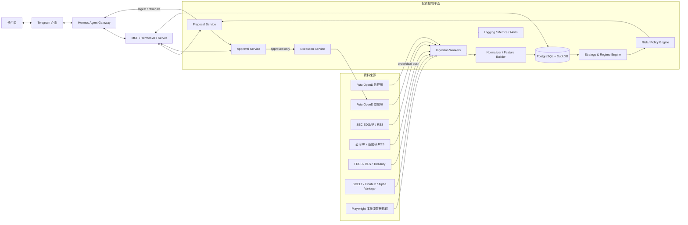

# 打造可自治且可審批的個人投資代理藍圖

## 執行摘要

最穩妥的做法，不是把「下單權限」直接交給一個通用型代理，而是把整個系統拆成兩個層次：一個**可驗證、可審計、決策受限的投資控制平面**，負責資料蒐集、風險檢查、提案生成、審批狀態機與最終下單；另一個則是**Hermes Agent 作為使用者互動與研究推理外殼**，透過 Telegram 與你對話，並藉由 MCP 或 Hermes API Server 讀取投資控制平面的工具與狀態。這樣可以同時利用 Hermes 的 Telegram Gateway、MCP、技能系統、記憶與 API Server，又不讓它直接握有不受約束的交易能力。Hermes 官方文件明確支援 Telegram、MCP 工具伺服器、OpenAI 相容 API Server，以及本地／Docker／SSH 等多種執行後端；Futu OpenAPI 則提供持倉、資金、訂單、報價訂閱、下單、改單與訂單推送回調。citeturn30search0turn30search2turn24search0turn24search1turn28view0turn4search0turn4search4turn5search0turn4search7turn6search2

針對你列出的需求，我的**首選方案**是：在 Mac mini 上常駐執行 Python 控制平面、兩個分離的 Futu OpenD 實例、Hermes Gateway、PostgreSQL 與 DuckDB；Hermes 透過本地 MCP/HTTP 與控制平面互通；Telegram 由 Hermes 原生接管或由自建 bot 負責審批按鈕；所有實盤下單都必須先形成 `proposal`，再經過 Telegram「批准／拒絕」或二段式確認後，才由專用執行服務即時解鎖交易並送單。這樣的設計特別重要，因為 Futu 文件明確說明：**實盤交易的 unlock 是 OpenD 層級動作，只要其中一條連線解鎖，其他連線也能呼叫交易介面**；因此監控與實際下單應分開到不同 OpenD 埠與不同程序邊界。citeturn6search0turn31search0turn31search5turn31search12

在資料來源上，最值得優先採用的免費／官方來源依序是：**Futu 帳戶狀態與持倉**、**SEC EDGAR API 與 RSS**、**公司投資人關係 RSS／新聞稿頁面**、**FRED/BLS/Treasury 等官方宏觀資料**、以及 **GDELT** 作為廣覆蓋新聞發現層。對美股即時行情而言，真正穩定的「正式可用」免費來源其實不多；Alpha Vantage 官方文件已明示，其美股即時或 15 分鐘延遲資料屬受監管範圍，通常需要 premium；因此若你的 Futu 帳戶沒有足夠報價權限，**美股即時正式資料**將是最接近「不可避免」的付費項目。可接受延遲、研究級或備援用途時，Alpha Vantage、Finnhub、GDELT 與本地 Playwright 抓取就足夠。citeturn10search16turn11search2turn11search4turn14search0turn14search4turn14search5turn10search3turn13search0turn34search0turn13search1turn33search2

對「自治但不是純反應式」這一點，正確實作方式不是讓 LLM 看到新聞就喊買賣，而是建立三層節奏：**快迴圈**做持倉／訂單／價格與風險監控，**中迴圈**做新聞、財報與市場 regime 偵測，**慢迴圈**做策略參數檢討、觀察名單更新與假設重估。策略調整的產物應該是「結構化提案」，而不是直接下單。所有提案都要經過**政策引擎、倉位限制、最大價差、重複單檢查、審批 TTL**，並在送單前做一次 revalidation。Futu 的文件還提醒，`place_order` 的回應與訂單/成交推送存在非同步競態，回調甚至可能先於 API 回傳到達，因此執行層必須做事件對帳與冪等設計。citeturn31search4turn6search2turn6search10turn5search0

如果只想做一個**最小但正確**的第一版，建議先完成四件事：**只讀監控**、**結構化提案**、**Telegram 審批**、**紙上交易／回測與事件重播**；等提案品質、審批 UX 與風險控制穩定後，再接通實盤送單。Futu 文件指出紙上交易支援市場單與限價單，且不需要 unlock，但不支援所有成交相關推送與完整實盤行為，因此它很適合流程驗證，不適合直接當成實盤等價物。citeturn4search9turn6search3turn6search10

## 目前落地：Advisor-first 操作入口

控制平面已經累積 thesis、catalyst、earnings review、run card、trade journal、behavior report、shadow report 與 research goal 等多個審計層。這些表單適合 debug、人工覆核與追溯，但日常使用不應要求使用者逐一選 ID 或手動串流程。

因此目前 dashboard 的第一入口改成 `AI Advisor Brief`：

- Agent 自動讀取 portfolio、pending proposals、research goals、theses、catalysts、earnings reviews、behavior reports、shadow reports 與 shadow events。
- Agent 亦讀取獨立 Market Context Lens，預設追蹤 SPY/QQQ/IWM/DIA/VIXY/TLT/GLD/USO 作為大盤、成長股、小型股、波動率、利率、黃金與油價背景。
- Market Regime / Risk Budget Lens 會把 market context 轉成 `risk_appetite`、`growth_pressure`、`rates_pressure`、`volatility_regime`、`inflation_pressure` 與 `proposal_bias`，只作 proposal 審批背景。
- Brief 會把結果排序成 `blocked`、`action`、`watch`、`info`，並給出下一步建議。
- 按 `讓 Agent 自動分析` 時，可以自動建立最新輕量 behavior report，讓交易行為診斷更新到 brief。
- Hermes 透過 MCP `get_advisor_brief` 讀同一份 brief，讓對話入口可以直接給建議，而不是要求使用者手動選 report / thesis / catalyst ID。
- Market Context Lens 和 proposal watchlist 分開；market symbols 只影響風險背景與 advisor warning，不自動成為交易 proposal 候選。
- Market-context quote snapshots 亦被 watchlist resolver 排除，除非該 symbol 是持倉或明確加入 `INVEST_AGENT_WATCHLIST`。
- 這仍然是 research-only workflow：不自動建立 proposal、不自動 approve、不 unlock Futu、不送 live order。
- 原本的手動表單保留為「控制平面 / 審計工作台」，而不是日常主入口。

## 總體架構與資料流



這張圖的關鍵不是元件數量，而是**權限分層**。Hermes 位於「互動與研究」邊界，能夠讀資料、詢問你、解釋提案、傳送批准按鈕，但真正的下單權在投資控制平面內部；交易密碼、unlock、下單、改單、冪等鍵、再驗證與審計記錄都留在控制平面。Hermes 官方文件支援 Telegram Gateway、MCP 伺服器、API Server 與多種 terminal backend；Futu 文件則支援本地 OpenD 連線、持倉/資金/訂單查詢、實盤 unlock 與下單。citeturn30search2turn24search0turn24search1turn28view0turn31search3turn31search5turn4search0turn4search4turn4search7turn6search0

我建議把 Futu 拆成**監控埠**與**交易埠**兩個 OpenD 實例。原因有二。第一，Futu 官方說明 unlock trade 是針對 OpenD，而不是單一 Python context；只要某條連線解鎖，所有其他連線都能呼叫交易介面。第二，Futu 也提供多實例配置方式，可建立多份 OpenD 目錄與不同 `api_port`。所以最穩妥的設計，是把監控、研究、報價訂閱與交易執行分到不同埠與不同程序，並讓 `FExec` 只接受批准後的最小化 order intent。citeturn6search0turn31search0

資料流要採用**事件驅動優先、輪詢補充**。Futu 報價與交易都支援 push callback；這比高頻輪詢更省配額，也更適合做持倉即時監控與下單回報。SEC Structured Disclosure RSS 每 10 分鐘更新、GDELT 約每 15 分鐘更新，剛好可作為中頻新聞與文件層；Playwright 則補足沒有 API 或 RSS 的頁面。citeturn5search0turn6search2turn6search10turn11search4turn10search3turn9search0

## 元件設計、資料來源與整合選項

**建議技術棧**

| 層級 | 建議選型 | 替代方案 | 為何這樣選 |
|---|---|---|---|
| 代理互動層 | **Hermes Agent** | 自建 Telegram bot + LangGraph / PydanticAI | Hermes 原生支援 Telegram、MCP、API Server、技能、記憶與多後端，最適合當 UX 與研究外殼。citeturn30search0turn30search2turn24search0turn28view0 |
| 控制平面 API | **FastAPI** | Flask, Django, Litestar | FastAPI 適合 typed REST/async 工作流，對 proposal／approval／execution API 很合適。citeturn35search0turn35search3 |
| 排程器 | **APScheduler** | Celery Beat, Prefect, system cron | APScheduler 能做週期任務、持久化 job store；但生產排程仍交給本地 launchd 啟動與保活。citeturn35search1turn35search4turn35search10turn22view0 |
| 交易/帳戶接入 | **Futu OpenD + Python SDK** | 只抓 Web UI、非官方 wrapper | 官方支援持倉、資金、訂單、報價訂閱與下單；比純 scraping 穩定。citeturn4search0turn4search4turn5search0turn4search7 |
| 分析儲存 | **DuckDB + Parquet** | Polars-only, ClickHouse | DuckDB 適合本機研究、回測、特徵計算與歷史事件重播。citeturn35search2turn35search5turn35search17 |
| 交易狀態儲存 | **PostgreSQL** | SQLite WAL | 我會把 proposal、approval、audit、order intent 放進一個具交易語義的主資料庫；若要極簡 MVP，可先用 SQLite WAL，但實盤建議升級到 PostgreSQL。這是架構建議，而不是官方限制。 |
| 本地瀏覽器擷取 | **Playwright Python** | Selenium | Playwright 支援 macOS、Chromium/WebKit/Firefox、headless/headed，且可透過 CDP 連到既有 Chromium。citeturn9search0turn9search1turn9search7 |
| 可觀測性 | **Prometheus + OpenTelemetry + Loki** | Elastic stack, Better Stack | Prometheus 適合指標，OpenTelemetry 提供 traces/metrics/logs，Loki 適合成本較低的日誌彙整。citeturn17search0turn17search1turn17search2turn17search11turn17search17 |

**Hermes 整合方式比較**

| 方案 | 連接方式 | 最適合用途 | 優點 | 缺點 | 建議 |
|---|---|---|---|---|---|
| **Hermes 作為主介面，控制平面以 MCP 暴露工具** | Hermes `mcp_servers`（stdio 或 HTTP） | 你的需求最匹配 | Hermes 可直接在 Telegram 中調用 `get_portfolio_snapshot`、`create_trade_proposal` 等工具，還能做技能與記憶管理。citeturn24search0turn24search1turn29view0 | 需要你額外寫 MCP server | **首選** |
| **自建控制平面，Hermes API Server 作為推理後端** | OpenAI 相容 `/v1/chat/completions` / `/v1/responses` | 你已經有自己的 Telegram bot/前端 | 很容易把 Hermes 當 reasoning backend，並保留 tools/memory。citeturn28view0 | 你要另外維護 bot 與 session 對接 | 次選 |
| **把 Futu 技能/文件包裝成 Hermes 技能** | `SKILL.md` / external skill dirs | 研究與協助開發 | Futu 官方提供 AI 用 Markdown 文件與技能包，Hermes 支援 skills 與 external dirs。citeturn25view0turn26view0 | 技能不是交易授權邊界；仍需獨立控制平面 | 可作輔助 |
| **不用 Hermes，只用 LangGraph/PydanticAI** | 純 Python 程式化 | 想要完全程式碼控制 | LangGraph 強於長流程狀態與 HITL；PydanticAI 強於型別化輸出。citeturn15search1turn15search5turn16search0 | 你會失去 Hermes 現成的 Telegram/MCP/API/memory 生態 | 不符合你的「要連 Hermes」前提 |

**資料來源比較**

| 資料來源 | 類型 | 官方/免費性 | 取得方式 | 建議用途 | 主要限制 |
|---|---|---|---|---|---|
| **Futu OpenAPI / OpenD** | 持倉、資金、訂單、即時報價、下單 | 官方；是否可取即時資料取決於帳戶權限 | Python SDK + 本地 OpenD | 實盤帳戶真實狀態、持倉監控、送單 | unlock 是 OpenD 層級；需處理權限、配額與回調競態。citeturn4search0turn4search4turn5search0turn6search0turn31search4 |
| **SEC EDGAR API + RSS** | 公司申報、XBRL、公告 | 官方且免費 | REST + RSS | 財報、8-K、10-Q/10-K、重大事件 | 不是價格源；需做公司/CIK 映射。citeturn10search0turn10search16turn11search2turn11search4 |
| **公司 IR / 新聞稿 RSS** | 公司正式新聞與財報公告 | 官方且通常免費 | RSS / HTML | 公司級一手消息 | 各站格式不一。citeturn11search1turn11search2 |
| **FRED / BLS / Treasury Fiscal Data** | 宏觀與利率/經濟資料 | 官方；FRED 需 API key、BLS 公開可用、Treasury API 可直接訪問 | REST | regime 偵測、風險因子、宏觀特徵 | 頻率較低，不是即時市場微結構資料。citeturn14search0turn14search3turn14search4turn14search5 |
| **GDELT** | 多來源新聞發現 | 公開免費 | DOC/Event API | 廣覆蓋新聞線索探索與主題追蹤 | 噪音高，需你自己做實體與關聯清洗。citeturn10search3turn10search11 |
| **Finnhub** | 公司新聞、價格、websocket trade | 官方供應商；有免費個人方案 | REST + WebSocket | 備援新聞/價格/事件源 | 免費層屬個人使用；某些資料範圍有限。citeturn13search1turn13search2turn13search4turn33search1turn33search2 |
| **Alpha Vantage** | 歷史/技術指標/部分新聞 | 官方供應商；多數 API 免費，但免費層很小 | REST + 官方 MCP | 研究、技術指標、低頻備援 | 免費層約 25 requests/day；美股即時/延遲資料通常要 premium。citeturn13search0turn13search3turn34search0turn34search1 |
| **Playwright 本地抓取** | HTML 頁面、登入後畫面 | 工具免費；資料使用需遵守站點條款 | Headless / persistent context / CDP | 沒 API/RSS 的頁面補洞 | 容易脆弱；必須尊重條款與 robots。citeturn9search0turn9search1turn9search7 |
| **yfinance** | 非官方 Yahoo Finance 包裝 | 開源免費，但僅適合個人／研究 | Python library | 研究與原型、非正式備援 | 官方文件與 repo 都提醒屬個人用途、研究教育用途，不宜作正式生產行情源。citeturn12search0turn12search1turn12search6 |

**免費與必要付費的取捨**

| 項目 | 可否免費完成 | 何時可能必須付費 | 我的判斷 |
|---|---|---|---|
| Futu 帳戶持倉/資金/訂單監控 | 可以 | 幾乎不需要 | 用官方 OpenD 即可。citeturn4search0turn4search4turn6search12 |
| 美股歷史資料與低頻研究 | 可以 | 不一定 | SEC／FRED／Alpha Vantage／Finnhub／GDELT 足夠。citeturn10search0turn14search0turn13search0turn13search1 |
| 美股「正式穩定」即時資料 | **未必** | 若 Futu 權限不足，通常要付費 | 這是最可能 unavoidable 的項目，因為官方供應商對美股即時/延遲資料有額外規則與 entitlements。citeturn34search0turn6search14 |
| 新聞 ingestion | 大致可以 | 若你要極低延遲、專業新聞授權 | 先用 SEC + 公司 IR + GDELT + Finnhub；一般個人代理足夠。citeturn11search2turn10search3turn33search2 |
| Telegram 互動 | 可以 | 不需要 | Telegram Bot API 本身免費。citeturn8search0turn37view2turn37view3 |
| LLM 推理 | 可以 | 若你不用本地模型則通常要付費 | Hermes 支援本地模型與雲端供應商；若要壓低成本，可把昂貴模型留給慢迴圈策略檢討。citeturn24search5turn7search6 |

## 自主控制、審批與安全合規

**自治控制迴路設計**

你要的「自治」應該是**有節奏地更新假設與配置**，而不是只靠事件觸發。建議把控制邏輯拆成三個 cadence。**快迴圈**每 30 秒到 5 分鐘：根據 Futu 的 position/funds/order 與 quote push，檢查價格脫離、部位集中度、現金購買力、未完成訂單與市場狀態。**中迴圈**每 15–60 分鐘：整理 SEC/IR/GDELT/Finnhub 新聞、財報、8-K 與宏觀更新，重算 watchlist 的情緒、事件風險與 regime 標記。**慢迴圈**每日或每週：回顧近期策略表現、參數適配、觀察名單更新、事件日曆與未來調整提案。Futu 的推送與 Hermes 的 jobs/cron 能支撐這種分層節奏，但交易動作仍應停在 proposal 階段。citeturn5search0turn6search2turn10search0turn11search4turn10search3turn28view0turn30search2

在這個架構裡，**LLM 不直接產生 order**，而是產生結構化 `proposal`：包含 thesis、觸發原因、候選標的、建議方向、目標權重、最大倉位、失效時間、建議 order type、置信度與反證點。然後由規則型風險引擎檢查：是否違反最大集中度、是否與既有 open orders 衝突、是否超出買入力、是否落在財報黑窗、自訂冷卻時間是否到期、以及價格是否已超出可接受滑價。只有通過這些檢查的 proposal，才會被送往 Telegram/Hermes 要求你批准。這一段主要是架構建議，核心依據是 Futu 有即時帳戶/訂單/回調能力，而 Hermes 能安全地把提案帶到 Telegram。citeturn4search0turn4search4turn6search2turn30search0turn30search2

**審批工作流**

最推薦的流程是：`signal -> proposal -> policy_check -> human approval -> revalidation -> unlock_trade -> place_order -> order/deal push -> reconcile -> notify`。Telegram 官方 Bot API 支援 inline keyboard 與 `callback_query`，並可用 long polling 的 `getUpdates` 或 webhook 的 `setWebhook`。對本地 Mac mini 而言，**long polling 往往比 webhook 更省事**，因為你不必把本機暴露成公網 HTTPS 端點；若採 webhook，Telegram 支援 `secret_token` 驗證標頭。citeturn37view0turn37view1turn37view2turn37view3turn8search4

下單前的 **revalidation** 不能省。因為 Futu 文件明確指出 `place_order` 的同步回傳與非同步推送之間可能發生競態，所以審批成功之後，執行器仍應再次抓取：最新價格、market state、open orders、現金與持倉；確認 proposal 未過期、價格漂移未超標、沒有出現重複單，然後才 unlock 與送單。送單後不要只依賴 `place_order` 的立即回傳，而要把 API 回傳與後續的 order/deal push 以 `order_id` 對帳整併。citeturn31search4turn6search2turn6search10turn4search7

**Hermes 與 Telegram 的授權邊界**

若你讓 Hermes 直接面向 Telegram，請務必使用它的**allowlists 或 pairing**。Hermes 的安全文件說明：若未配置允許名單且未顯式開放，未授權使用者將被拒絕；它也支援 pairing code 核准、TTL、速率限制與檔案權限控制。對你的場景，建議只允許你自己的 Telegram user ID，或用 pairing 但關閉群組/開放式存取。citeturn27view0

Hermes 若以 API Server 方式對外提供能力，預設只綁在 `127.0.0.1`，並使用 bearer token；若你真的要給瀏覽器前端直連，才需要設 CORS allowlist。這意味著最好的部署方式是：Telegram/Hermes 與投資控制平面都只綁本機 loopback，外部只有 Telegram 到 bot 的官方通道，不直接暴露你的交易 API。citeturn28view0

**安全與合規重點**

密鑰管理方面，Mac 上最好的本地選擇是 **Keychain Services**；Apple 文件說明 keychain 是加密資料庫，Secure Enclave 則是與主處理器隔離的硬體安全子系統。實作上，我建議把 Futu 交易密碼、Telegram token、Hermes API key、Alpha Vantage/Finnhub keys 放進 macOS Keychain，程式啟動時再短暫取得工作憑證；若某些元件堅持用 `.env`，至少要設置 0600 權限。Hermes 官方也要求 secrets 放在 `.env`，並建議對其權限做限制。citeturn21search1turn21search2turn21search7turn30search10turn27view0

Futu 連線建議開啟**協議加密**。官方文檔指出可以在建立 quote/trade context 時用 `is_encrypt` 打開，也可以在 Python 全域使用 `enable_proto_encrypt`；加密需在 OpenD 與 client 端都配置 RSA 私鑰。這在同一台主機上雖然不是唯一安全措施，但能避免本機代理、誤配置或跨容器路徑造成的明文風險。citeturn32search4turn32search6turn31search9

資料授權方面，要特別注意**美股即時行情與再分發限制**。Alpha Vantage 官方文件直接指出美股即時與 15 分鐘延遲資料受交易所、FINRA 與 SEC 規則約束，個人用途與商用條件不同。類似地，Yahoo/yfinance 明確寫明僅供個人使用、研究教育用途。這意味著：你可以把這些資料用於你自己的代理，但不要把它做成對外服務、群組轉播或面向他人的產品而沒有另外處理授權。citeturn34search0turn12search0turn12search1

## 部署、監控、測試與時程

**Mac mini 常駐部署**

在 macOS 上，最自然的常駐管理器是 **launchd**。Apple 文件指出 `launchd` 是 macOS 的 daemon/agent 管理機制，`launchctl` 負責載入與卸載，`KeepAlive` 可確保程序常駐，`StartInterval` 與 `StartCalendarInterval` 可做定時啟動，`StandardOutPath` / `StandardErrorPath` 可把輸出寫入檔案，而且被 `launchd` 管理的程序不應自行 daemonize。對你的專案，這比把所有東西塞進同一個 shell script 或用第三方守護工具更符合平台。citeturn18search2turn22view0

我建議的常駐程序拆分如下：

| 程序 | 啟動方式 | 是否必須常駐 | 說明 |
|---|---|---|---|
| `futu-opend-monitor` | launchd LaunchAgent/Daemon | 是 | 只讀監控埠，供持倉/資金/報價/訂單查詢與推送。citeturn31search0turn31search5 |
| `futu-opend-trade` | launchd | 是 | 只給執行器使用；平時保持 locked。citeturn6search0turn31search0 |
| `investctl-api` | launchd + FastAPI/Uvicorn | 是 | proposal/approval/execution 主 API。citeturn35search0 |
| `investctl-scheduler` | launchd + APScheduler | 是 | 中慢迴圈、自動掃描、回補任務。citeturn35search4turn35search10 |
| `hermes-gateway` | launchd | 是 | Telegram Gateway、MCP、可選 API Server。citeturn30search2turn28view0 |
| `postgresql` | Homebrew service 或容器 | 建議 | proposal/audit/approval/order intent 主庫。 |
| `playwright-worker` | launchd 或工作程序池 | 視情況 | 只在沒有 API/RSS 的來源啟用。citeturn9search0 |

如果你想保持 Mac mini 真正 24/7 在線，Apple 官方也提供系統設定：對桌機可以啟用「Prevent automatic sleeping when the display is off」，必要時開啟「Wake for network access」。這些是很實際但常被忽略的運維前提。citeturn36search0turn36search5

**容器化選項**

| 選項 | 推薦程度 | 何時使用 | 代價 |
|---|---|---|---|
| **原生 Python + launchd** | **最高** | 生產環境首選 | 最省 RAM、最少 VM 額外層、最好與 Keychain/OpenD/本地檔案整合。citeturn18search2turn22view0 |
| **Hermes 自身用 Docker backend，交易控制平面仍原生** | 高 | 想隔離代理執行指令風險 | Hermes 官方對 Docker backend 有安全 hardening 與資源限制；很適合把 Hermes 與主機隔開。citeturn27view0turn24search7 |
| **Docker Desktop / Colima / Compose** | 中 | 開發、重現依賴、測試環境 | Docker Desktop 在 macOS 需要支援版本與至少 4GB RAM；Colima 提供 Docker 相容但仍是額外虛擬化層。citeturn19search0turn19search1turn19search13 |
| **Podman Desktop** | 中低 | 偏好開源容器工具 | Podman 在 macOS 同樣依賴 VM，運維複雜度不比原生小。citeturn19search2turn19search17 |

**監控與可觀測性**

至少要追蹤五類指標：`portfolio_value`、`proposal_count`、`approval_latency`、`order_submit_success/fail`、`news_ingest_lag`。Prometheus Python client 適合把這些 metrics 暴露為本地 HTTP endpoint；OpenTelemetry Python 可補 traces 與 logs；Loki 適合把 JSON logs 集中查詢。若你不想一開始就建完整 observability stack，也至少要產生結構化 JSON logs，並把 proposal、approval、execution 與 callback 全部帶上 `correlation_id`。citeturn17search0turn17search1turn17search10turn17search11turn17search17

**測試、模擬與回測**

測試要分三層。第一層是**單元與契約測試**：Futu adapter、proposal schema、approval state machine、price drift revalidation、新聞解析器。第二層是**事件重播測試**：重播歷史 quote/news/order push，檢查 proposal 是否按照預期生成。第三層是**紙上交易與回測**：Futu 紙上交易適合驗證送單流程，`vectorbt` 或 `backtesting.py` 適合做歷史參數掃描與假設比較。要注意的是，Futu 紙上交易雖支援市場單與限價單、改單/撤單，但不等價於完整實盤行為，因此上線前仍要做極小資金 live smoke test。citeturn4search9turn6search3turn16search1turn20search0

CI/CD 我建議走「**GitHub Actions 做驗證，不做生產排程**」的策略。GitHub 官方文件說明，scheduled workflows 最短 5 分鐘、以 UTC 排程，而且在高負載時可能延遲甚至丟棄；這對市場開收盤、財報前後或風控節點都不夠可靠。生產排程應交給本地 launchd + APScheduler。若你將來想用 self-hosted runner，GitHub 也明確提醒這類 runner 可能接觸敏感網路與 secrets，應隔離到專門 runner group，而**不要**直接跑在你的生產交易主機上。citeturn23search0turn23search1turn23search3turn23search12

**估計工時與里程碑**

以下是基於上述範圍的規劃估算；它屬於專案估時，而不是外部文件中的固定事實。

| 里程碑 | 內容 | 估時 |
|---|---|---|
| **MVP 基線** | Mac mini 基礎環境、launchd、Keychain、Postgres/DuckDB、Hermes 安裝、Futu OpenD 監控埠打通 | 1–2 週 |
| **只讀資料面** | 持倉/資金/訂單/報價、SEC/IR/GDELT ingest、資料標準化、基本 dashboard/API | 1–2 週 |
| **提案引擎** | regime 標記、新聞摘要、結構化 proposal、風險規則、審計表 | 2–3 週 |
| **Telegram/Hermes 介面** | Hermes MCP 整合、proposal 呈現、批准/拒絕、通知回報 | 1–2 週 |
| **模擬與回測** | vectorbt/backtesting.py、事件重播、紙上交易 smoke test | 1–2 週 |
| **實盤最小上線** | 交易埠 OpenD、二段式批准、revalidation、冪等與錯誤恢復 | 1–2 週 |
| **強化階段** | 更完整策略、自動報表、更多資料源、observability/告警 | 持續演進 |

以一位熟悉 Python、API、資料工程與基礎運維的工程師來看，**可用 MVP 約 6–8 週，較穩健的實盤版約 10–14 週**；若你要同時做較成熟的策略研究與高品質 UI/報表，時間還會再增加。

**未決問題與限制**

目前仍有幾個必須在實作前確認的變數。第一，你的 Futu／moomoo 帳戶實際區域、主體與美股報價權限是否已含即時資料，這會影響是否需要額外付費行情源。第二，你要 Hermes 直接做 Telegram Gateway，還是保留自建 bot 專做審批；兩者都可行，但權限邊界不同。第三，你的策略、風險容忍度與 order types 目前未指定，因此我把它們都視為可配置參數，而不是在架構內硬編碼。第四，若未來這個代理不只服務你的自有帳戶，而是涉及他人資金或對外提供建議/執行服務，監管定位會顯著改變，這部分應在法務層面另行確認。  

## GitHub 倉庫、框架與程式片段

**值得優先採用的 GitHub 倉庫與框架**

| 倉庫 / 框架 | 用途 | 你應該怎麼用 |
|---|---|---|
| **NousResearch/hermes-agent** | 核心代理、Telegram gateway、MCP、API Server、skills | 把它當成你的互動層與研究外殼；不要當最終交易權威。citeturn15search0turn7search3turn24search0turn28view0 |
| **langchain-ai/langgraph** | 長流程、狀態化 agent orchestration | 若你想在控制平面中加入 code-first 的 checkpoint/HITL 狀態圖，可用它實作 proposal 流程。citeturn15search1turn15search5 |
| **pydantic/pydantic-ai** | 型別化 agent workflows | 很適合把 `proposal`、`approval_result`、`risk_check` 做成嚴格 schema。citeturn16search0 |
| **microsoft/playwright-python** | 本地瀏覽器抓取與 E2E | 用於沒有 API/RSS 的新聞頁、登入後研究頁面與 scraping regression tests。citeturn9search4turn9search0 |
| **python-telegram-bot/python-telegram-bot** | 自建 Telegram bot | 如果你不直接用 Hermes Telegram Gateway，就用它做批准按鈕與對話層。citeturn16search2turn8search9 |
| **aiogram/aiogram** | 全 async Telegram bot | 若你整個控制平面都用 asyncio，aiogram 會比傳統同步 bot 框架更自然。citeturn16search7 |
| **polakowo/vectorbt** | 大量參數掃描與矩陣式回測 | 用來做策略族群、參數格點與 regime 分層回測。citeturn16search1 |
| **kernc/backtesting.py** | 較簡潔的 Python 回測 | 適合先快速驗證單一股票/單一規則策略，再往 vectorbt 擴充。citeturn20search0turn20search4 |
| **prometheus/client_python** | 指標暴露 | 把風控與 proposal/execution KPI 暴露成 metrics。citeturn17search1turn17search10 |
| **grafana/loki** / **OpenTelemetry Python** | 日誌彙總 / tracing | 形成完整 observability。citeturn17search8turn17search17turn17search0 |
| **microsoft/autogen** | 多代理框架 | 可參考，但官方 repo 已標示 maintenance mode，我不建議作為這個專案的主基座。citeturn15search2 |

**關鍵程式片段**

下面的片段是**架構骨架**，重點在顯示邊界、資料流與安全節點；實作時仍應補上重試、超時、日誌、資料庫、Keychain 與更多錯誤處理。

```yaml
# ~/.hermes/config.yaml
terminal:
  backend: docker
  docker_image: "python:3.12-slim"
  docker_forward_env: []
  container_cpu: 1
  container_memory: 2048

skills:
  external_dirs:
    - ~/agent-skills

mcp_servers:
  investctl:
    # 由你的投資控制平面提供的本地 MCP/HTTP 端點
    url: "http://127.0.0.1:8787/mcp"
    timeout: 30
    supports_parallel_tool_calls: false
    tools:
      include:
        - get_portfolio_snapshot
        - get_watchlist_quotes
        - get_news_digest
        - list_pending_proposals
        - create_trade_proposal
        - approve_trade_proposal
        - reject_trade_proposal
      resources: false
      prompts: false

unauthorized_dm_behavior: pair
```

```bash
# ~/.hermes/.env
TELEGRAM_BOT_TOKEN=your_bot_token
TELEGRAM_ALLOWED_USERS=123456789
API_SERVER_ENABLED=true
API_SERVER_KEY=replace_me
```

這個配置利用 Hermes 的 Telegram Gateway、MCP 與 Docker terminal backend，把代理互動層與交易控制平面連起來；真正的下單仍由你自己的 `approve_trade_proposal`/`Execution Service` 控制。citeturn30search0turn30search2turn24search0turn29view0turn27view0

```python
# futu_adapter.py
from __future__ import annotations

from dataclasses import dataclass
from typing import Any, Dict, Optional
from futu import (
    RET_OK,
    OpenQuoteContext,
    OpenSecTradeContext,
    TrdEnv,
    TrdMarket,
    TrdSide,
    OrderType,
)

MONITOR_PORT = 11111   # OpenD A: read-only monitor
TRADE_PORT = 11112     # OpenD B: execution only


@dataclass
class FutuConfig:
    host: str = "127.0.0.1"
    monitor_port: int = MONITOR_PORT
    trade_port: int = TRADE_PORT
    trade_password: str = ""          # 實務上請從 Keychain 讀取
    is_encrypt: bool = True


def get_portfolio_snapshot(cfg: FutuConfig) -> Dict[str, Any]:
    quote_ctx = OpenQuoteContext(
        host=cfg.host,
        port=cfg.monitor_port,
        is_encrypt=cfg.is_encrypt,
    )
    trade_ctx = OpenSecTradeContext(
        filter_trdmarket=TrdMarket.US,
        host=cfg.host,
        port=cfg.monitor_port,
        is_encrypt=cfg.is_encrypt,
    )
    try:
        ret_pos, pos = trade_ctx.position_list_query(trd_env=TrdEnv.REAL)
        if ret_pos != RET_OK:
            raise RuntimeError(f"position_list_query failed: {pos}")

        ret_funds, funds = trade_ctx.accinfo_query(trd_env=TrdEnv.REAL)
        if ret_funds != RET_OK:
            raise RuntimeError(f"accinfo_query failed: {funds}")

        symbols = pos["code"].tolist() if len(pos.index) else []
        quotes = {}
        if symbols:
            ret_q, qdf = quote_ctx.get_market_snapshot(symbols)
            if ret_q == RET_OK:
                quotes = qdf.set_index("code").to_dict(orient="index")

        return {
            "positions": pos.to_dict(orient="records"),
            "funds": funds.to_dict(orient="records"),
            "quotes": quotes,
        }
    finally:
        trade_ctx.close()
        quote_ctx.close()


def place_approved_order(
    cfg: FutuConfig,
    *,
    code: str,
    qty: int,
    price: float,
    side: str,
    order_type: OrderType = OrderType.NORMAL,
    dry_run: bool = False,
) -> Dict[str, Any]:
    """
    僅在 approval + revalidation 通過後由執行器呼叫。
    """
    trade_ctx = OpenSecTradeContext(
        filter_trdmarket=TrdMarket.US,
        host=cfg.host,
        port=cfg.trade_port,
        is_encrypt=cfg.is_encrypt,
    )
    try:
        if dry_run:
            env = TrdEnv.SIMULATE
        else:
            env = TrdEnv.REAL
            ret_unlock, data_unlock = trade_ctx.unlock_trade(cfg.trade_password)
            if ret_unlock != RET_OK:
                raise RuntimeError(f"unlock_trade failed: {data_unlock}")

        trd_side = TrdSide.BUY if side.upper() == "BUY" else TrdSide.SELL
        ret, data = trade_ctx.place_order(
            price=price,
            qty=qty,
            code=code,
            trd_side=trd_side,
            order_type=order_type,
            trd_env=env,
        )
        if ret != RET_OK:
            raise RuntimeError(f"place_order failed: {data}")

        return {
            "order_id": data["order_id"].iloc[0],
            "code": code,
            "qty": qty,
            "price": price,
            "side": side,
            "env": str(env),
        }
    finally:
        trade_ctx.close()
```

這個片段刻意把**監控埠**與**交易埠**分離；實盤下單只在 `trade_port` 上做，且在最後一刻才 unlock。這正是因應 Futu 的 OpenD unlock 模型。citeturn6search0turn31search0turn31search5turn31search12

```python
# local_news_scraper.py
from __future__ import annotations

import asyncio
from typing import List, Dict
from playwright.async_api import async_playwright


async def scrape_headlines(url: str, selector: str) -> List[Dict[str, str]]:
    """
    給沒有 RSS/API 的新聞頁面做本地抓取。
    正式使用前請先確認站點條款與 robots policy。
    """
    async with async_playwright() as p:
        browser = await p.chromium.launch(headless=True)
        page = await browser.new_page()
        await page.goto(url, wait_until="networkidle")
        items = await page.locator(selector).all()
        output = []
        for item in items[:20]:
            text = (await item.inner_text()).strip()
            href = await item.get_attribute("href")
            output.append({"title": text, "href": href or ""})
        await browser.close()
        return output


if __name__ == "__main__":
    headlines = asyncio.run(
        scrape_headlines(
            url="https://example.com/markets",
            selector="a.headline-link",
        )
    )
    for h in headlines:
        print(h)
```

Playwright 適合做本地瀏覽器抓取，尤其當你要在 Mac mini 上使用持久 session、頭less/headed 模式或對接既有 Chromium 環境時。citeturn9search0turn9search1turn9search7

```python
# telegram_approval_bot.py
from __future__ import annotations

from telegram import InlineKeyboardButton, InlineKeyboardMarkup, Update
from telegram.ext import Application, CallbackQueryHandler, CommandHandler, ContextTypes

BOT_TOKEN = "replace_me"   # 實務上請從 Keychain 或秘密管理讀取


async def send_proposal(update: Update, context: ContextTypes.DEFAULT_TYPE) -> None:
    proposal_id = "prop_20260525_001"
    keyboard = InlineKeyboardMarkup(
        [
            [InlineKeyboardButton("批准", callback_data=f"approve:{proposal_id}")],
            [InlineKeyboardButton("拒絕", callback_data=f"reject:{proposal_id}")],
        ]
    )

    text = (
        "提案 prop_20260525_001\n"
        "AAPL BUY 10 @ 198.50\n"
        "理由：財報後觀察名單轉強 + 組合權重回補\n"
        "TTL：15 分鐘\n"
        "請批准或拒絕。"
    )
    await update.message.reply_text(text, reply_markup=keyboard)


async def on_callback(update: Update, context: ContextTypes.DEFAULT_TYPE) -> None:
    query = update.callback_query
    await query.answer()
    action, proposal_id = query.data.split(":", 1)

    # 這裡實務上應呼叫你的 approval API
    if action == "approve":
        await query.edit_message_text(f"{proposal_id} 已批准，等待送單。")
    else:
        await query.edit_message_text(f"{proposal_id} 已拒絕。")


def main() -> None:
    app = Application.builder().token(BOT_TOKEN).build()
    app.add_handler(CommandHandler("proposal", send_proposal))
    app.add_handler(CallbackQueryHandler(on_callback))
    app.run_polling(allowed_updates=["message", "callback_query"])


if __name__ == "__main__":
    main()
```

Telegram Bot API 官方明確支援 `InlineKeyboardMarkup`、`callback_query`，而且 long polling 的 `getUpdates` 非常適合本地機器開發與小型常駐 bot。citeturn37view0turn37view1turn37view2

```python
# approval_api.py
from __future__ import annotations

from datetime import datetime, timedelta, timezone
from fastapi import FastAPI, HTTPException
from pydantic import BaseModel

app = FastAPI()


class Proposal(BaseModel):
    proposal_id: str
    symbol: str
    side: str
    qty: int
    limit_price: float
    expires_at: datetime
    status: str = "PENDING"


FAKE_DB: dict[str, Proposal] = {}


@app.post("/proposals/{proposal_id}/approve")
async def approve_proposal(proposal_id: str):
    proposal = FAKE_DB.get(proposal_id)
    if not proposal:
        raise HTTPException(status_code=404, detail="proposal not found")

    if proposal.status != "PENDING":
        raise HTTPException(status_code=409, detail="proposal already processed")

    if proposal.expires_at < datetime.now(timezone.utc):
        proposal.status = "EXPIRED"
        raise HTTPException(status_code=409, detail="proposal expired")

    # revalidation skeleton:
    latest_price = proposal.limit_price  # TODO: 從最新 quote source 讀取
    max_slippage_bps = 30
    drift_bps = abs(latest_price - proposal.limit_price) / proposal.limit_price * 10000

    if drift_bps > max_slippage_bps:
        raise HTTPException(status_code=409, detail="price drift exceeded reapproval threshold")

    proposal.status = "APPROVED"
    # TODO: enqueue execution intent with idempotency key
    return {"proposal_id": proposal_id, "status": proposal.status}
```

這個片段展示的是**人機審批不是最後一道防線，送單前 revalidation 才是**。它應搭配最新帳戶／持倉／開單／價格資訊與冪等鍵一起使用。FastAPI 很適合承載這種結構化 API。citeturn35search0

## 2026-05-25 設計更新：研究品質與證據帳本先行

本階段採用兩個外部 repo 的「概念」，但不搬入會破壞 approval / execution 邊界的能力：

- Anthropic `financial-services` 作為 skill / workflow 參考，尤其是 equity research 的 thesis tracker、earnings review、catalyst calendar。其 README 明確定位為 analyst work product，需要 human sign-off，不做交易執行、投資建議或風險批准；這與本 app 的 proposal-first / approval-first 原則相容。
- HKUDS `Vibe-Trading` 作為 research sidecar / backtest sidecar 參考，尤其是 Research Goal runtime、evidence rows、shadow account / trade journal analyzer。其 2026-05-24 更新提到 goals 會保存 claims、acceptance criteria、evidence rows、budgets、completion policy，REST/MCP 也暴露 goal snapshots 和 evidence writes。

**本 repo 的採用邊界**

先採用：

1. Research Goal / Evidence Ledger。
2. Proposal 前置 evidence gate。
3. Hermes MCP 的 research-only 工具。
4. Dashboard 的研究狀態可視化。

暫不採用：

1. 任何外部 sidecar 的 approval / execution / shell / file-write 權限。
2. 任何能繞過本機 policy engine 的 swarm 或 agent 直接批准交易流程。
3. 付費 vendor MCP connector。
4. live trading path。

**已開始落地的 schema**

```text
research_goals
- id
- symbol
- objective
- protocol
- risk_tier
- status
- token_budget
- turn_budget
- claims[]
- criteria[]
- summary
- created_at
- completed_at

research_evidence
- id
- goal_id
- symbol
- source_type
- source_uri
- text
- data_as_of
- retrieved_at
- freshness_status
- verification_status
- source_verified
- added_via
- confidence
- caveat
- contradicts_claim_ids[]
- run_card_id

proposals
- research_goal_id
- manual_override_reason
- evidence_hash
- thesis_id

theses
- id
- symbol
- side
- thesis_statement
- status
- conviction
- target_price
- stop_loss_trigger
- pillars[]
- risks[]
- updates[]

thesis_updates
- id
- thesis_id
- research_goal_id
- evidence_hash
- impact: strengthens | weakens | neutral | invalidates
- summary
- action_bias

catalysts
- id
- symbol nullable
- event_type
- title
- description
- event_date
- event_time_hint
- timezone
- expected_impact
- source_uri
- source_type
- verification_status
- source_verified
- status
- linked_thesis_id
- linked_research_goal_id
- actual_outcome_summary
- thesis_delta
- created_via
- created_by

catalyst_reviews
- id
- catalyst_id
- research_goal_id
- evidence_hash
- actual_outcome_summary
- thesis_delta
- action_bias
- run_card_id
- created_at

earnings_reviews
- id
- symbol
- period
- catalyst_id
- research_goal_id
- thesis_id
- revenue_yoy
- net_income_yoy
- operating_income_yoy
- operating_cash_flow_yoy
- diluted_eps_yoy
- cashflow_quality
- thesis_delta
- action_bias
- evidence_hash
- score
- warnings
- run_card_id
- scoring_version
- dataset_hash
- created_at

research_run_cards
- id
- run_type: earnings_review | catalyst_review | event_replay | safe_autonomy_cycle | proposal_draft | backtest_import | behavior_report
- status: running | completed | failed | cancelled
- symbol nullable
- actor: scheduler | cli | dashboard | mcp | api | system
- trigger_source: manual | scheduled | catalyst_completed | proposal_draft | replay | smoke | system
- code_version
- rule_version
- input_hash
- output_hash
- dataset_hash
- evidence_hash
- linked research_goal / thesis / catalyst / catalyst_review / earnings_review / proposal ids
- metrics_json
- warnings_json
- assumptions_json
- outputs_json
- artifacts_json
- started_at
- completed_at

trade_imports
- id
- source: futu_csv | generic_csv
- filename
- file_hash
- imported_at
- imported_by
- row_count
- parse_warnings_json
- run_card_id

trade_fills
- id
- import_id
- broker
- broker_order_id nullable
- broker_trade_id nullable
- symbol
- broker_symbol
- side: buy | sell
- qty
- price
- fees
- currency
- market
- traded_at
- raw_row_hash
- raw_json
- created_at

trade_roundtrips
- id
- import_id nullable
- symbol
- opened_at
- closed_at
- qty
- buy_price
- sell_price
- buy_fees
- sell_fees
- holding_days
- realized_pnl
- realized_pnl_pct
- currency
- pairing_method
- created_at

behavior_reports
- id
- period_start nullable
- period_end nullable
- symbols_json
- total_trades
- total_roundtrips
- win_rate
- profit_loss_ratio
- avg_holding_days
- trade_frequency_per_week
- total_realized_pnl
- max_drawdown
- top_symbols_json
- hourly_distribution_json
- market_distribution_json
- diagnostics_json
- run_card_id
- created_at

shadow_strategies
- id
- name
- description
- source_behavior_report_id
- extraction_method
- status: draft | active | archived
- created_via
- human_confirmed
- confirmed_at nullable
- confirmed_by nullable
- run_card_id
- created_at
- updated_at

shadow_rules
- id
- strategy_id
- rule_type: entry | exit | sizing | cooldown | catalyst | thesis | stop_loss | take_profit
- condition_json
- action_json
- confidence
- support_count
- violation_count
- created_at

shadow_reports
- id
- strategy_id
- behavior_report_id
- period_start nullable
- period_end nullable
- total_evaluated_trades
- rule_violation_count
- early_exit_count
- late_exit_count
- missed_signal_count
- counterfactual_pnl nullable
- actual_pnl
- delta_pnl nullable
- diagnostics_json
- run_card_id
- created_at

shadow_events
- id
- shadow_report_id
- symbol
- event_type: rule_violation | early_exit | late_exit | oversized_trade | ignored_catalyst | thesis_mismatch | post_event_review_missing | contradicted_earnings_review
- actual_fill_ids_json
- roundtrip_id nullable
- expected_action_json
- actual_action_json
- pnl_impact nullable
- explanation
- created_at
```

**新的 proposal flow**

```text
Futu/SEC/IR/news/fundamentals refresh
→ draft proposal candidate from directional news
→ create research_goal
→ attach directional evidence
→ attach verified primary-source / SEC companyfacts evidence
→ attach run_card_id when evidence came from a structured research artifact
→ evaluate evidence gate
→ if sufficient: create PENDING proposal through policy engine
→ if insufficient: keep research note only, do not create proposal
→ any direct proposal path must still provide research_goal_id or manual_override_reason
→ human approval still required
→ paper execution only
```

Evidence gate 的第一版規則很保守：

- 必須有至少一筆 directional market/news evidence。
- 必須有至少一筆 source-verified primary-source 或 SEC companyfacts evidence。
- MCP / remote agent / manual text 不能把自己標成 source-verified。
- verified evidence 必須與 research goal symbol 一致。
- stale primary-source evidence 不通過 gate。
- contradicting evidence 會把 gate 標成 mixed / insufficient，需要人工審閱。
- research goal 必須保持 `research-only` risk tier。
- gate 不通過時，Hermes / autonomy / REST / dashboard 只能看到研究目標與 skip reason，不會得到 pending proposal；若人類手動建立，必須寫明 `manual_override_reason`。
- 每個 created proposal 都保存 `evidence_hash`，用來固定建立 proposal 當下的 evidence ledger 指紋。

**已開始落地的檔案**

```text
src/invest_agent/research_goals.py
src/invest_agent/models.py
src/invest_agent/store.py
src/invest_agent/proposal_drafts.py
src/invest_agent/autonomy.py
src/invest_agent/api.py
src/invest_agent/mcp_server.py
src/invest_agent/thesis_tracker.py
src/invest_agent/catalysts.py
src/invest_agent/earnings_review.py
src/invest_agent/run_cards.py
src/invest_agent/trade_journal.py
src/invest_agent/shadow_account.py
tests/test_research_goals.py
tests/test_thesis_tracker.py
tests/test_catalysts.py
tests/test_earnings_review.py
tests/test_run_cards.py
tests/test_trade_journal.py
tests/test_shadow_account.py
```

**下一步**

1. 持續守住 proposal invariant：所有 `PENDING` proposal 必須有 `research_goal_id` 或明確 `manual_override_reason`。
2. 持續守住 verified provenance：MCP / user-submitted evidence 不能直接變成 source-verified。
3. Thesis Tracker 已落地第一版：持倉 thesis、pillar、risk、invalidation condition、research-goal-backed thesis updates，並在 proposal creation 前做 thesis invariant。
4. Catalyst Calendar 已落地第一版：earnings、investor day、product、regulatory、macro、conference、expected impact、post-event review，並在 proposal creation 前做 catalyst invariant。
5. Earnings Review 已落地第一版：本機 SEC companyfacts → deterministic YoY scoring → catalyst review / thesis delta artifact，不產生 approval 或 execution。
6. Run Card / Trust Layer artifact 已落地第一版：earnings review、catalyst review、event replay 會輸出可 hash、可讀、可掛 evidence 的 JSON/Markdown artifact；Hermes 只能 read-only 查詢。
7. Trade Journal / Behavior Report 已落地第一版：Futu/generic CSV import、file-hash idempotency、FIFO roundtrip、win rate、PnL ratio、drawdown、disposition / overtrading / chasing / anchoring diagnostics；Hermes 只能 read-only 查詢。
8. Shadow Account / Counterfactual Report 已落地第一版：從 behavior reports 抽取 deterministic draft rules，人工確認後檢查 early/late exits、thesis mismatch、ignored catalyst、earnings review mismatch；Hermes 只能 read-only 查詢。
9. 將 Vibe / backtest sidecar 保持為 research-only adapter，輸出 run card 到 evidence ledger，不接 approval/execution。
10. 最後才碰 live path：Keychain、雙 OpenD、atomic approval、idempotency、broker-side revalidation、order/deal reconciliation。
